<picture>
  <source media="(prefers-color-scheme: dark)" srcset="./assets/header-dark.svg">
  <source media="(prefers-color-scheme: light)" srcset="./assets/header-light.svg">
  
</picture>

 

I design and build software end to end: the contract, the backend, and the interface people actually touch.

Lately I work where Web3 meets AI agents, on agents that can hold value, earn a reputation, and be trusted with a transaction. The rest of my time goes to plain, useful apps for schools, shops, and local communities.

I study Informatics at Universitas Pamulang, where I'm writing my thesis on tamper-proof digital certificates anchored on-chain with Merkle trees.

 

**Stack** &nbsp;·&nbsp; TypeScript, React, Next.js, Svelte, Solidity, Rust, Python, Laravel, Flutter 
**Chains** &nbsp;·&nbsp; Monad, Base, Solana, Ethereum, Avalanche, Algorand 
**Setup** &nbsp;·&nbsp; Debian, Hyprland, Neovim, Obsidian

 

<picture>
  <source media="(prefers-color-scheme: dark)" srcset="https://raw.githubusercontent.com/rhmatzeka/rhmatzeka/output/snake-dark.svg">
  <source media="(prefers-color-scheme: light)" srcset="https://raw.githubusercontent.com/rhmatzeka/rhmatzeka/output/snake-light.svg">
  
</picture>

 

[rahmateka.my.id](https://rahmateka.my.id) &nbsp;·&nbsp; [LinkedIn](https://www.linkedin.com/in/rahmatekasatria/) &nbsp;·&nbsp; [Email](mailto:matsganz@gmail.com) &nbsp;·&nbsp; [Telegram](https://t.me/luwakwhitecofeee) &nbsp;·&nbsp; [Instagram](https://www.instagram.com/rhmat.dev/)
