### 👋 Hi, I'm Rahmat

I build things end to end: smart contract, backend, UI, and deploy.
Most days you'll find me where **Web3 meets AI agents**, and the rest of the time shipping apps that real people use every day.

- 🎓 Informatics student at **Universitas Pamulang**, writing my thesis on Merkle-based digital certificates
- 🏆 Hackathon regular, happiest when a demo works at 3 AM ☕
- 🐧 Daily driver: **Debian + Hyprland + Neovim**, notes in an Obsidian second brain

### 🧭 What I Do

⛓️ **Web3** · smart contracts and dApps on EVM chains and Solana, simple enough for everyday users

🤖 **AI Agents** · agents that reason, transact, and earn trust on-chain, not just chat

🧩 **Fullstack** · from database to deploy, for schools, stores, and communities

### 🛠️ Stack

 

 

  

### 📈 Activity

<picture>
  <source media="(prefers-color-scheme: dark)" srcset="https://raw.githubusercontent.com/rhmatzeka/rhmatzeka/output/pacman-contribution-graph-dark.svg">
  <source media="(prefers-color-scheme: light)" srcset="https://raw.githubusercontent.com/rhmatzeka/rhmatzeka/output/pacman-contribution-graph.svg">
  
</picture>

  

**Got an idea, a hackathon, or a problem worth solving? Let's build it.**

