<picture>
  <source media="(prefers-color-scheme: dark)" srcset="./assets/hero-dark.svg">
  <source media="(prefers-color-scheme: light)" srcset="./assets/hero-light.svg">
  
</picture>

 

I design and build software end to end: the contract, the backend, and the interface people actually touch.

Lately I work where Web3 meets AI agents, on agents that can hold value, earn a reputation, and be trusted with a transaction. The rest of my time goes to plain, useful apps for schools, shops, and local communities. My thesis is about tamper-proof digital certificates anchored on-chain with Merkle trees.

 

<picture>
  <source media="(prefers-color-scheme: dark)" srcset="./assets/stack-dark.svg">
  <source media="(prefers-color-scheme: light)" srcset="./assets/stack-light.svg">
  
</picture>

<picture>
  <source media="(prefers-color-scheme: dark)" srcset="./assets/toolbox-dark.svg">
  <source media="(prefers-color-scheme: light)" srcset="./assets/toolbox-light.svg">
  
</picture>

 

<picture>
  <source media="(prefers-color-scheme: dark)" srcset="https://raw.githubusercontent.com/rhmatzeka/rhmatzeka/output/snake-dark.svg">
  <source media="(prefers-color-scheme: light)" srcset="https://raw.githubusercontent.com/rhmatzeka/rhmatzeka/output/snake-light.svg">
  
</picture>

 

